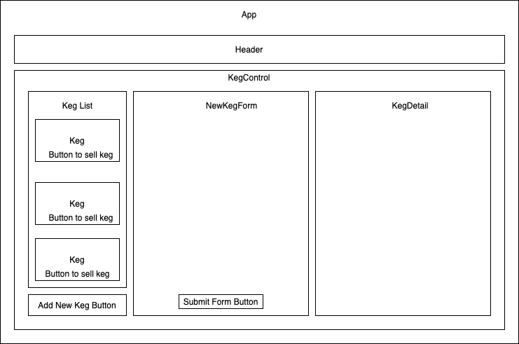

# Tap Room

#### By Austin Butler

## Description

_A React/redux App where a bar can track their kegs_

## Setup/Installation Requirements to run locally:

* _Step 1: Clone this repository https://github.com/austinb847/tap-room-redux_
* _Step 2: Cd to new directory_
* _Step 3: Run npm install to install dependencies_
* _Step 3: Run npm run start to start local server_
* _Step 5: Navigate to localhost:3000_

## Component Diagram

## Technologies Used

* React
* Redux
* HTML
* CSS
* Bootstrap

Copyright (c) 2020 **_Austin Butler_**
